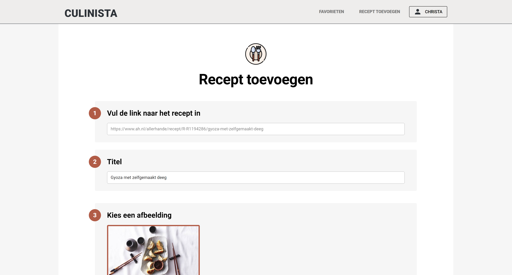

# Culinista

This repository contains the frontend code for Culinista.nl, a website to keep track of your favourite recipes.




## Project Setup

```sh
npm install
```

### Compile and Hot-Reload for Development

```sh
npm run dev
```

### Type-Check, Compile and Minify for Production

```sh
npm run build
```

### Lint with [ESLint](https://eslint.org/)

```sh
npm run lint
```

### To Publish to Azure Blog Storage

Deploy dist folder to $web via azure plugin
